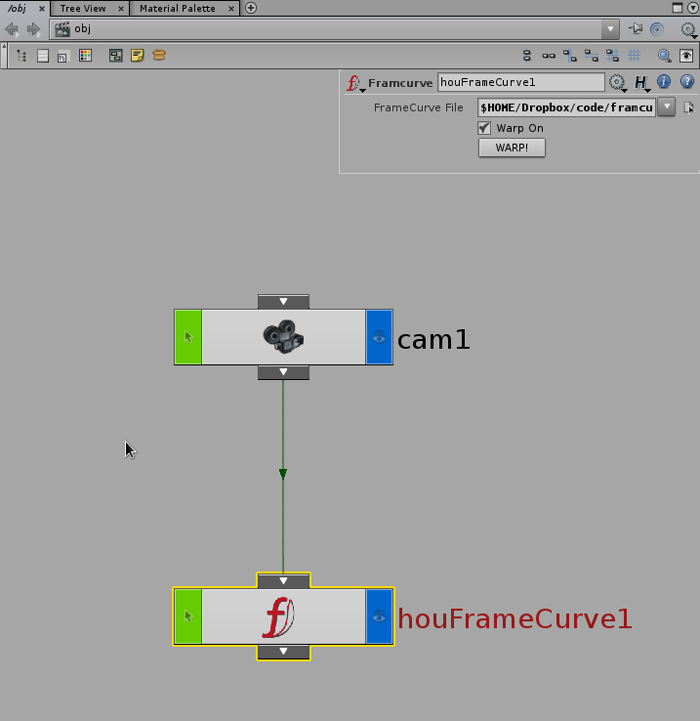
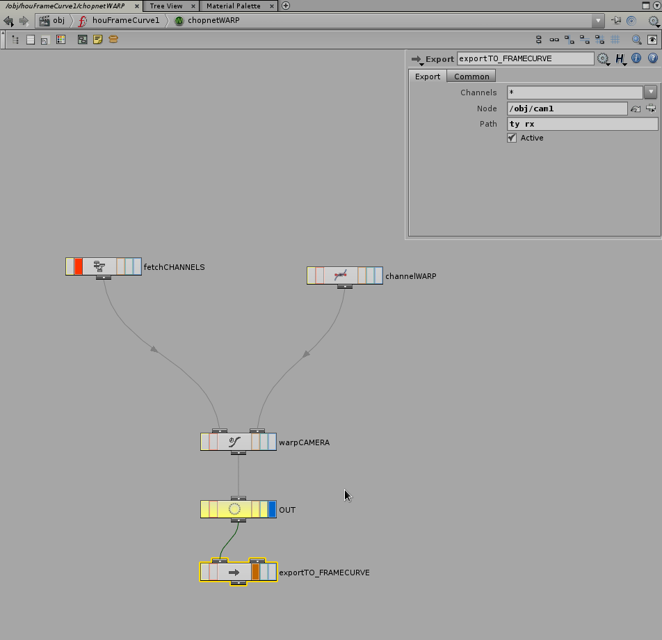

# Framecurve Houdini module

First of all, you will need our OTL module. [Download the OTL](scripts/framecurve.otl)
Load the asset into Houdini, and create the node.

Load the framecurve file into the node and hit "WARP!". To temporarily disable the animation, disable the "Warp on" checkbox.
The node contains the following chopnet:

## License

The scripts here are covered with [framecurve license](http://framecurve.org/scripts/#license).